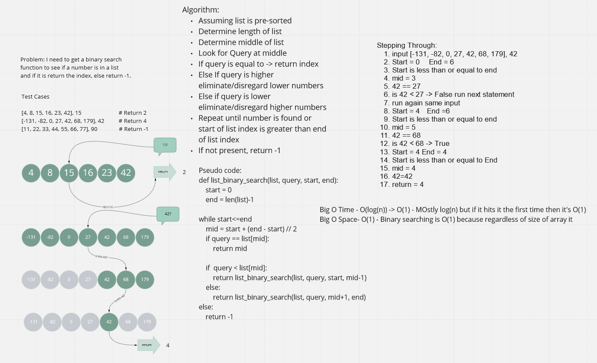

# Array Binary Search

Finds a value in a given sorted array and return it's index value using a binary search. 
If number doesn't exist in arry return -1. 

## Whiteboard Process -> 

## Approach & Efficiency

1. Recieve a list and value query
2. Determine length
3. Once length is determined found find middle index(rounded to integer)
4. Check index if number matches 
5. If yes return index - if no go to 6.
6. Determine if query higher or lower than current num and remove opposite half from search paramenters
7. continue till found, or can not search anymore.
8. If can not search anymore then return -1

Big O Time - O(log(n)) -> O(1) - MOstly log(n) but if it hits it the first time then it's O(1)
Big O Space- O(1) - Binary searching is O(1) because regardless of size of array it 

[Fun Reading on a Binary Bug](https://thebittheories.com/the-curious-case-of-binary-search-the-famous-bug-that-remained-undetected-for-20-years-973e89fc212)