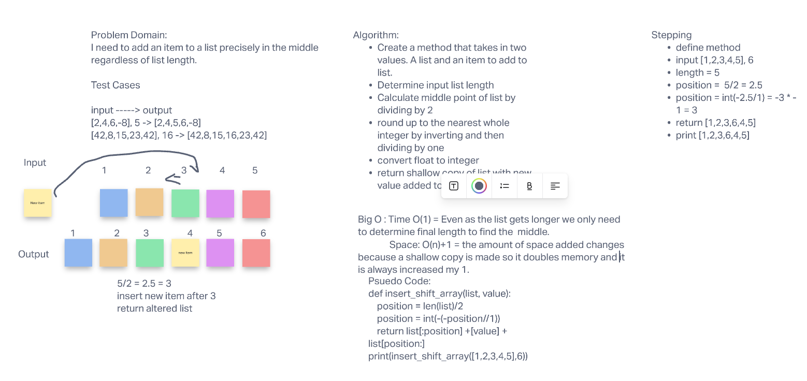

# Insert into Middle of List

Take a list of any size and a value and add the value to the middle of the list (rounded up)

## Whiteboard Process -> 

## Approach & Efficiency

1. Recieve a list and value to add
2. Determine length
3. Once length is found find middle rounded up
4. add value to list at middle
5. Return modified array

Big O Space - O(n)+1 - Method will return a shallow copy of the list that is longer by 1 
Big O Time - O(1) - Even as list gets longer we only need to determine it's length to find the middle. 
