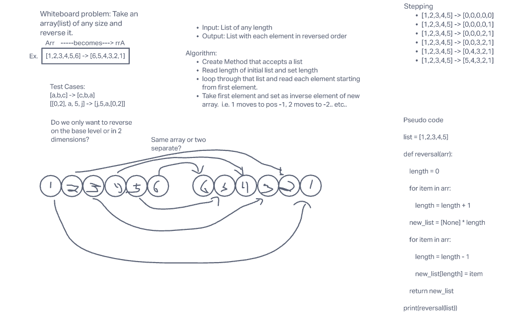

# Reverse an Array

Take a list of any size with any set of values and return it in reversed order. 

## Whiteboard Process -> 

Note on whiteboard index of original list to inverse-1

## Approach & Efficiency

1. Recieve a list
2. Iterate through list to determine length
3. Once length is found, create new array of length
4. Assign index of original array to inverse-1 index of new array

Big O Space - O(n)
Big O Time - O(n)
The space and time required is directly relational to size of original array since it will always double the amount of space and time needed, 