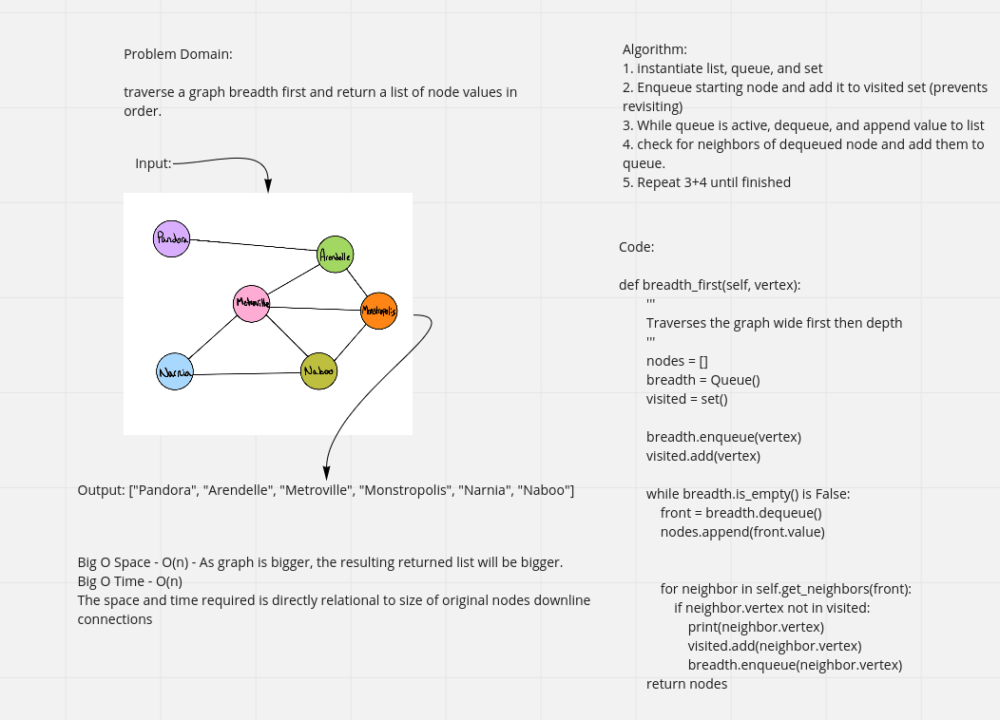

# Breadth fist graph traversal

 Travel wide instead of deep along a graph from a given node

## Whiteboard Process -> 

[Source code](../../data_structures/graph.py)

## Approach & Efficiency

1. instantiate list, queue, and set
2. Enqueue starting node and add it to visited set (prevents revisiting)
3. While queue is active, dequeue, and append value to list
4. check for neighbors of dequeued node and add them to queue.
5. Repeat 3+4 until finished

Big O Space - O(n) - As graph is bigger, the resulting returned list will be bigger. 
Big O Time - O(n)
The space and time required is directly relational to size of original nodes downline connections 