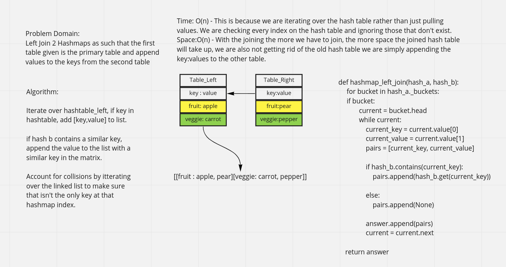

# Hashtable Left-Join
    Take a string and find the first instance of a repeated word in it. 

## Whiteboard Process -> 

[Final Code](../../code_challenges/hashtable_left_join.py)

## Approach & Efficiency

Iterate over hashtable_left, if key in hashtable, add [key,value] to list.

if hash b contains a similar key, append the value to the list with a similar key in the matrix.

Account for collisions by itterating over the linked list to make sure that isn't the only key at that hashmap index.

Time: O(n) - This is because we are iterating over the hash table rather than just pulling values. We are checking every index on the hash table and ignoring those that don't exist.

Space:O(n) - With the joining the more we have to join, the more space the joined hash table will take up, we are also not getting rid of the old hash table we are simply appending the key:values to the other table.