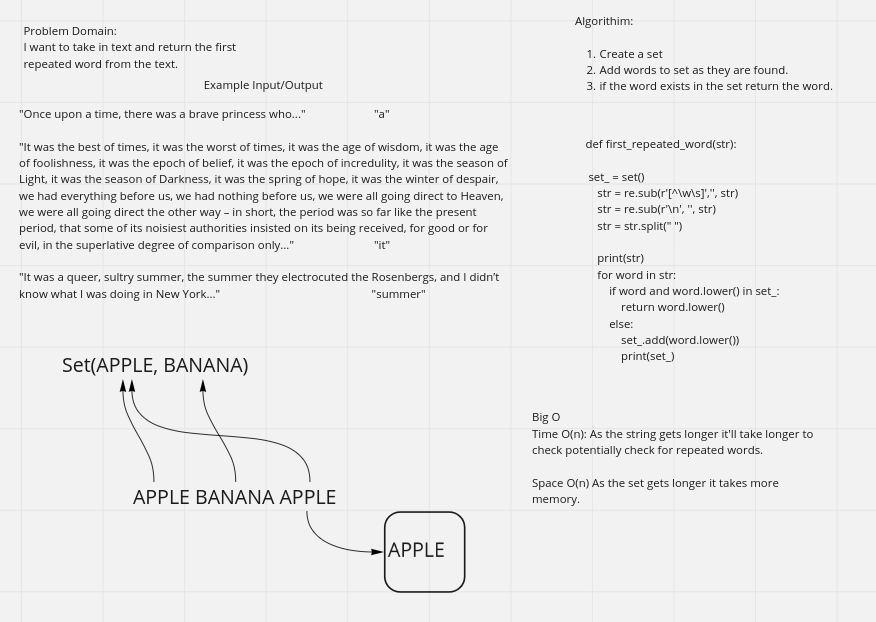

# Repeated Word
    Take a string and find the first instance of a repeated word in it. 

## Whiteboard Process -> 

[Final Code](../../code_challenges/hashtable_repeated_word.py)

## Approach & Efficiency

1. Create a set
2. populate set with words as you iterate through string
3. if you hit a match, return the match

Big O Space - O(n) - Method will continue until it finds the similar word, so it will generate a set as long as it doesn't find the word. The longer the string the longer the potential set.
Big O Time - O(n) - As the string gets longer, it takes more time to iterate through to find a matching word.  