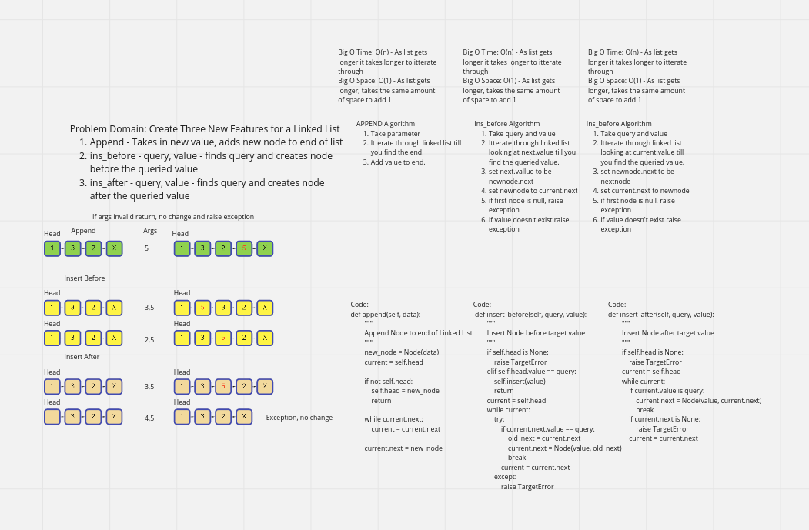

# Linked List Insertions

A singly linked list is a set of `Nodes` with or without a `Value` that connect to each other in one direction. Each Node can only see the node after it, as the reference was made during instantiation of the `node`.  

## Challenge

Create a Node class that has properties for the value of the Node and a pointer to the next Node. Thereby creating a linked list.

From that linked list vcreate functions which will append, and insert nodes before or after values. 

## Approach & Efficiency

Using a proactive testing approach to build a Linked list. We have designed tests ahead of the build before completion in order to rid any bugs before they happen.

Big O Time - O(n) as the list gets longer it will take longer to search as you must itterate over each item. 
Big O Space - O(1) When you add an item, you only ever add one to the beginning. It will always only add one at a time. 

## API

`append` - adds a new Node to the end of the list.

`insert` - adds a new Node to the beginning of the linked list.

`insert_before` - takes in two parameters a query and a value and will attempt to insert the node before the node which is queried
`insert_after` - takes in two parameters a query and a value and will attempt to insert the node after the node which is queried

## Whiteboard Process -> 

### Append

1. Recieve a linked_list
2. Recieve value
2. Iterate through list to determine end
3. Once end is found create new node at end with value

### Ins before

1. Recieve linked list
2. Recieve query and value
3. itterate over linked list to find query
4. Create new node before queried value
5. If value doesn't exist or list not started raise exception

### Ins After

1. Recieve linked list
2. Recieve query and value
3. itterate over linked list to find query
4. Create new node after queried value
5. If value doesn't exist or list not started raise exception