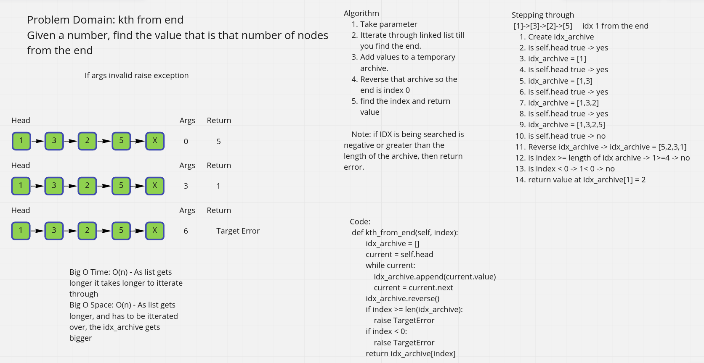

# Kth from the end of linked list

Take a linked list and find a value that is a certain amount of nodes from the end.

## Whiteboard Process -> 

[Final Code](../../data_structures/linked_list.py)

## Approach & Efficiency

1. Take parameter
2. Itterate through linked list till you find the end.
3. Add values to a temporary archive.
4. Reverse that archive so the end is index 0
5. find the index and return value

 Note: if IDX is being searched is negative or greater than the length of the archive, then return error.

Big O Space - O(n) - Method will return a copy of the full linked list values then invert them. So as linked list gets longer does this list of values get longer.  
Big O Time - O(n) - As the linked list gets longer, it takes more time to populate the array.  