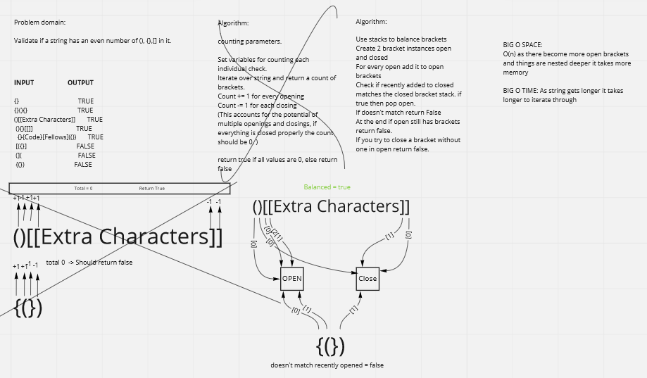

# Stack and queue Bracket Verfication

## Challenge

Given a string which includes brackets verify that they are concatted properly so that they are nested in a proper fashion.

## Approach & Efficiency

Using a proactive testing approach to build a Linked list. We have designed tests ahead of the build before completion in order to rid any bugs before they happen.

Big O Time - O(n) as the concatted string gets longer it takes longer to run as it checks everything
Big O Space - O(n) As things get more nested it takes more space to track the ppening brackets. 

## Code

[Code](../../code_challenges/stack_queue_brackets.py)

## Whiteboard

