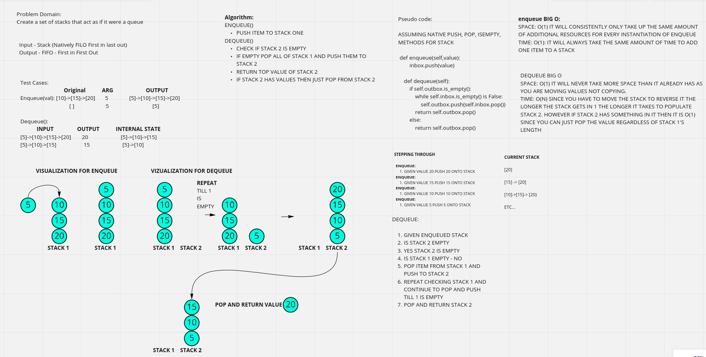

# Challenge Summary

Implement a queue using two stacks

## Whiteboard Process

## Approach & Efficiency

Use 2 stacks to emulate a queue by restacking queue 1 to queue 2 allowing us to pop from queue 2 

### Enqueue BIG O

SPACE: O(1) IT WILL CONSISTENTLY ONLY TAKE UP THE SAME AMOUNT OF ADDITIONAL RESOURCES FOR EVERY INSTANTIATION OF ENQUEUE

TIME: O(1): IT WILL ALWAYS TAKE THE SAME AMOUNT OF TIME TO ADD ONE ITEM TO A STACK

### DEQUEUE BIG O

SPACE: O(1) IT WILL NEVER TAKE MORE SPACE THAN IT ALREADY HAS AS YOU ARE MOVING VALUES NOT COPYING.

TIME: O(N) SINCE YOU HAVE TO MOVE THE STACK TO REVERSE IT THE LONGER THE STACK GETS IN 1 THE LONGER IT TAKES TO POPULATE STACK 2. HOWEVER IF STACK 2 HAS SOMETHING IN IT THEN IT IS O(1) SINCE YOU CAN JUST POP THE VALUE REGARDLESS OF STACK 1'S LENGTH

## Solution

### Queue

|Method|What does it do?|
:---:|:---|
|enqueue | Puts new nodes onto stack 1|
|dequeue | returns and removes first value in stack 2 unless stack 2 is empty then it moves all of stack 1 to stack 2| 
