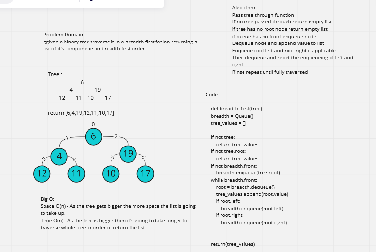

# Traverse a tree breadth first

Given a tree return a list of it's values breadth first. 

## Whiteboard Process -> 

[Final Code](../../code_challenges/tree_breadth_first.py)

## Approach & Efficiency

Big O Space - O(n) - Function takes more space as the tree gets bigger as the list to return will also grow. 
Big O Time - O(n) - As the tree gets bigger it takes longer to iterate through