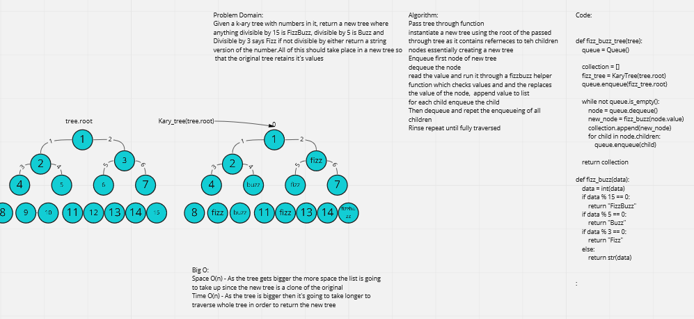

# Traverse a tree and returnvalues as fizz-buzz format.

Given a k-ary tree with numbers in it, return a new tree where anything divisible by 15 is FizzBuzz, divisible by 5 is Buzz and Divisible by 3 says Fizz. All of this should happen in a new tree, so that the original tree remains untouched.

## Whiteboard Process -> 

[Final Code](../../code_challenges/tree_fizz_buzz.py)

## Approach & Efficiency

Big O Space - O(n) - Function takes more space as the tree gets bigger the new clone will be bigger. 
Big O Time - O(n) - As the tree gets bigger it takes longer to iterate through, in order to check all values and populate new tree.