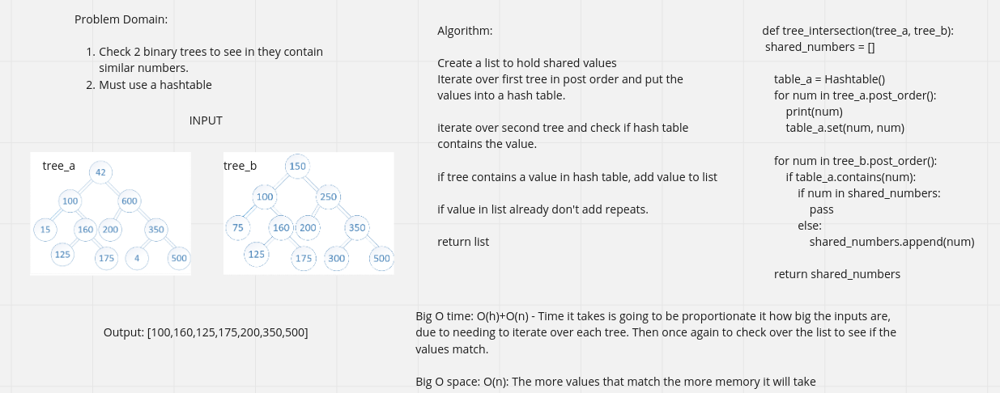

# Find all the values that match in two given trees

## Whiteboard Process -> 

[Final Code](../../code_challenges/tree_intersection.py)

## Approach & Efficiency

Big O time: O(h)+O(n) - Time it takes is going to be proportionate it how big the inputs are, due to needing to iterate over each tree. Then once again to check over the list to see if the values match.

Big O space: O(n): The more values that match the more memory it will take