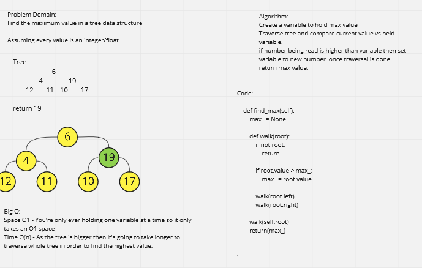

# Find the max value in a tree

Given a tree find the highest value in that tree.

## Whiteboard Process -> 

[Final Code](../../data_structures/binary_tree.py)

## Approach & Efficiency

Big O Space - O(1) - Method only uses the space of one variable which is already allocated and ready for it. 
Big O Time - O(n) - As the linked list gets longer, it takes more time to iterate through 