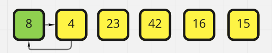
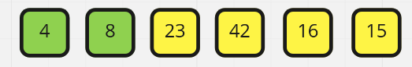

# Blog Notes: Insertion Sort

Insertion sort is a simple sorting algorithm, it's one you've probably even used without thinking about it. If you've ever held a hand of cards, you've probably moved them around to sort them by value, well, when you pull out the card and put it back where it needs to go, you're doing insertion sorting. 

Let's take a look at an example of insertion sorting. 

---

### How does it work

1. We will always assume that the first element in a list is already sorted since, well it's the only element we are looking at right now. 
2. We will select the following element and compare it to each of the values before it that we have already sorted. 
3. Each time we look at the element before it, if the number before it is larger then we will swap their positions. 
4. When there are no numbers left in the list, or the number before it is the same, we insert the value into it's new position. 
5. Repeat 2-5 until you fnish sorting the list. 

---

### What does this code look like?

```py

def insertion_sort(arr):
    for idx in range(1, len(arr)):

        val = arr[idx]

        j = idx-1

        while j >=0 and val < arr[j]:
            arr[j+1] = arr[j]
            j -= 1
        arr[j+1] = val
    return arr

```
Let's assume we have our `arr = [8,4,23,42,16,15]`. This array is messy and unsorted.  So let's go ahead and plug it through our function and watch what happens. 

If you follow what we are doing above, we are looking at the length of the array so we know how many numbers we need to go through 1-6. Looks like we are going to go through it 5 times.

For the sake of conciseness we are only going to handle one iteration of this code.

---

### First Iteration

`for idx in range(1, len(arr))` This tells us we are going to start at the second number and go to the 6th number which is the last number in the array. 

Current

|Variable|Value|
|:-:|:-:|
|idx|1|

Next we get the value of the array object at index of 1 `val = arr[idx]`

|Variable|Value|
|:-:|:-:|
|idx|1|
|val|4|

We will set our checking variable to the previous index of the array `j = idx-1`

|Variable|Value|
|:-:|:-:|
|idx|1|
|val|4|
|j|0|

Now we loop through to check this value against the previous values `while j >=0 and val < arr[j]:` or `while 0 >= 0 and 4 < 8`

|Variable|Value|
|:-:|:-:|
|idx|1|
|val|4|
|j|0|

Since those statements are `True` we then run the loop code `arr[j+1] = arr[j]` or Set the array object at index of `arr[j+1]` or in our case `arr[1]` value to that of `arr[j]` or `arr[0]` so now what we have is an array that looks a bit like this `arr = 8,8,23,42,16,15` which looks a bit weird... 

You might be wondering... "Where did our 4 go that we were looking at earlier go?"... Well we are hanging onto it in out `val` variable as seen on our variable table. It's still got it!

Going down one more line in the code we see `j -= 1` which is syaing `j = j-1` or `j = 0-1` which means j is now `j = -1`

|Variable|Value|
|:-:|:-:|
|idx|1|
|val|4|
|j|-1|

Now let's get our value put where it needs to go `arr[j+1]`  or `arr[-1+1]` or `arr[0] = val`. This makes our array `arr = 4,8,23,42,16,15`

ALL RIGHT! We've just sorted our first number. This process gets repeated numerous times. 



---

### Second Iteration

We aren't going to see any action here because this number is where it is supposed to be at this point. `arr = 4,8,23,42,16,15`

|Variable|Value|
|:-:|:-:|
|idx|2|
|val|23|
|j|1|



---

### Third Iteration

Nope, No action here either... `arr = 4,8,23,42,16,15`

|Variable|Value|
|:-:|:-:|
|idx|3|
|val|42|
|j|2|


---

### Fourth Iteration

Ok! We've got movement! Let's hop straight to the while loop where the action is! 

|Variable|Value|
|:-:|:-:|
|idx|4|
|val|16|
|j|3|

1. `3 >=0 and 16 < 42` -> `True` -> `arr = [4,8,23,42,42,15]`
2. `2 >=0 and 16 < 23` -> `True` -> `arr = [4,8,23,23,42,15]`
3. `1 >=0 and 16 < 8` -> False -> `arr[j+1] = val` -> `arr = [4,8,16,23,42,15]`


This Repeats for the final process giving us our final array.

This method of sorting comes with one major drawback. Time.

---

## Big O Analysis

Time: **O(n^2)** : OOF Here -> As you can see with every additional number we are going to add, it immensely increases the time it takes. Since we are checking every number before it potentially. So with 6 numbers we go through 1+2+3+4+5+6 = 21 times if we have 9 numbers we are going through 1+2+3+4+5+6+7+8+9 = 45 times. WHAT! we only added 3 numbers and we've more than double the amount of times the operation is going to run. 

Space: **O(1)** This method doesn't take up any space to speak of regardless of how many times this function runs, it moves things in place, so no need to worry here. 

---

## Visualization

