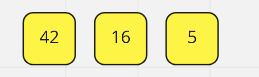

# Blog Notes: Merge Sort

Merge Sorting is a divide and tackle the problem type of algorithim. It breaks down a problem into smaller more simple problems before building everything back up again. 

---

## How does it work

1. Take your list and divide that in half. 
2. Seperate it into left and right partitions
3. Repeat this process until you have only one number in your partition
4. merge individiual numbers back together once you have 2 psuedo sorted lists. 
5. Ta Dah! 

### What Does the Code Look Like? 

```py
def merge_sort(arr):

    n = len(arr)
    print(f'Merge sorting {arr}')
    if n > 1:

        mid = n // 2

        left = arr[:mid]
        right = arr[mid:]
        
        print(f'Breaking apart into {left} and {right}')

        merge_sort(left)
        merge_sort(right)

        i = 0
        j = 0
        k = 0

        while i < len(left) and j < len(right):

            if left[i] <= right[j]:
                arr[k] = left[i]
                i += 1

            else:
                arr[k] = right[j]
                j += 1
            k += 1

        if i == len(left):

            while j< len(right):
                arr[k] = right[j]
                k += 1
                j += 1
        else:

            while i < len(left):
                arr[k] = left[i]
                k += 1
                i += 1

    return arr

```

Ok, so this is a long bit of code for something that seems so simple. The fun thing about merge sorting is that it operates on RECURSION! This allows something like this block of code to keep track of everything while it works. 

Let's break this code down into steps and follow along! (It's a lot of steps)

Merge sorting [8, 4, 23, 42, 16, 15]


Breaking apart into [8, 4, 23] and [42, 16, 15]

   

Merge sorting [8, 4, 23]


Breaking apart into [8] and [4, 23]


Merge sorting [8] -> It's an Only number so it's garunteed to be the lowest in the list

Merge sorting [4, 23]


Breaking apart into [4] and [23]

Merge sorting [4] -> It's an Only number so it's garunteed to be the lowest in the list

Merge sorting [23] -> It's an Only number so it's garunteed to be the lowest in the list

---

Now that we've recursively gone down and deconstructed the left branch, lets see what it's like putting them back together


Comparing [4] and [23] --> [4] < [23] so [4,23]


Merging [8] and [4,23] [8] > [4] so [4] then [8] < [23] so we get [4,8,23]


Our product: [4, 8, 23]

---

Now this process happens once again to the Right side now that we have recursively gone through the left. I'm going to leave the diagrams out for this one

Merge sorting [42, 16, 15]

Breaking apart into [42] and [16, 15]

Merge sorting [42] -> It's an Only number so it's garunteed to be the lowest in the list

Merge sorting [16, 15]

Breaking apart into [16] and [15]

Merge sorting [16]-> It's an Only number so it's garunteed to be the lowest in the list

Merge sorting [15]-> It's an Only number so it's garunteed to be the lowest in the list

---

Once that is taken care of we are going to take those numbers and sort them giving us [15, 16, 42]

Which we are now Going to merge into the left list [4, 8, 23]


---

Here is where we go back into the comparisons looking at each list and deciding which next number in the list is lower to decide if we pull from the left or right list to create the final one. And once we've gone through all of those we get this lovely list.  

Our product: [4, 8, 15, 16, 23, 42]


## Big O Analysis

Time: **O(log(n))** : As the function list itself gets bigger, it takes more time, but not quite as linear as you would think. It actually is Log(n) due to the fact that everything is split up conistently in recursion down to one. Then the time it takes to put together is O(n) due to the directly relational addition of one side to the other for a log(n)+n or dropping the constant, log(n) time. 


Space: **O(n)** : Strictly speaking even though we are constantly breaking the lists up into smaller lists, the reality is that we only maintain references to the original list and the new list when we are done. The references to the smaller bits disappear as we finish with them, giving this a space of O(n). 


---

Here is a giant diagram sort of to show you what all this looks like displayed out under the surface. 

